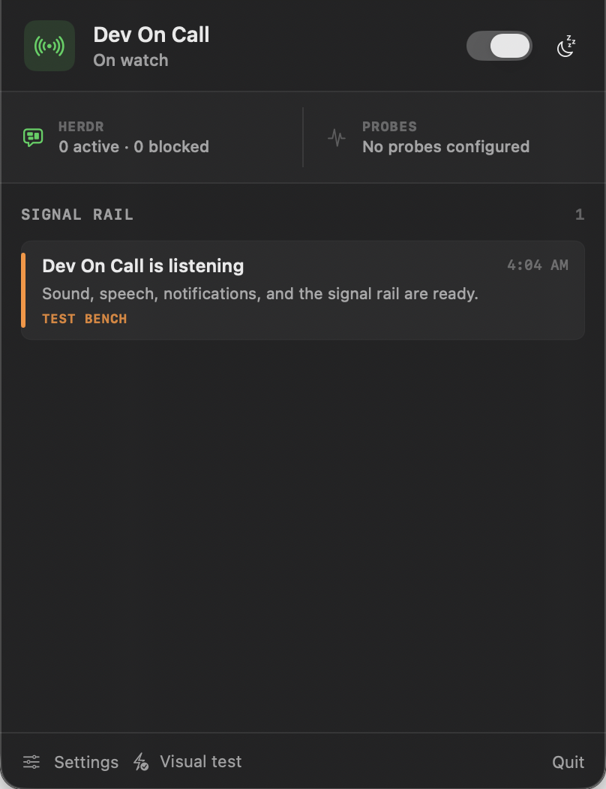
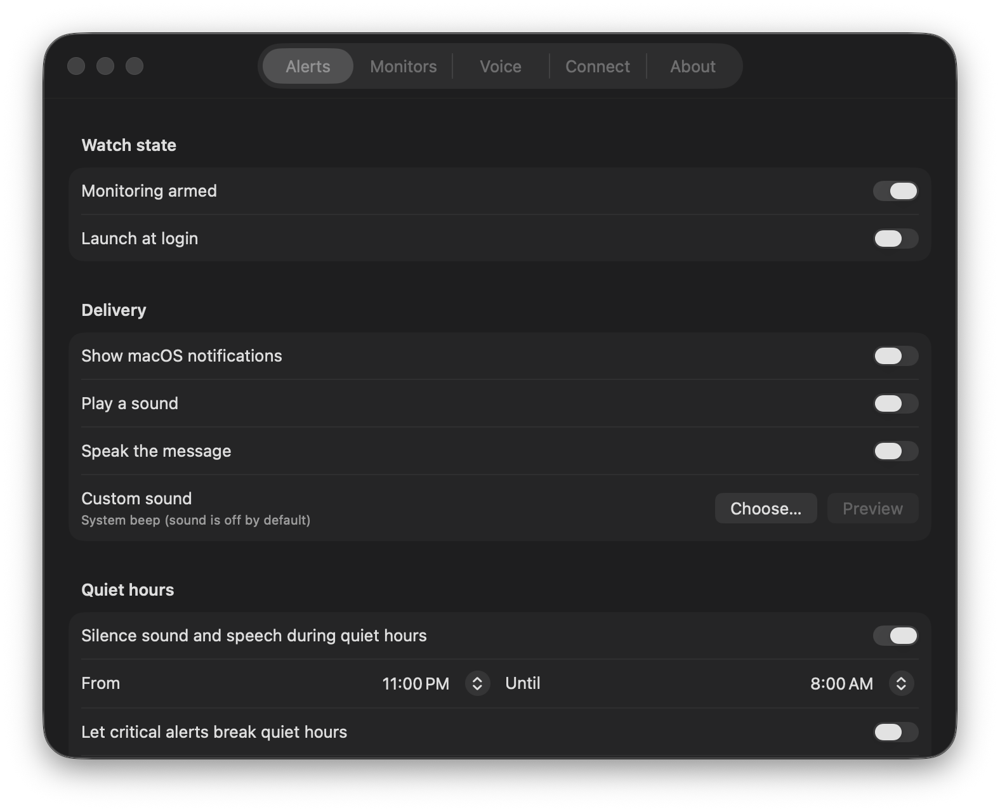

# Dev On Call

A quiet, local-first macOS menu-bar sentry for developers and their coding agents.

Dev On Call watches Herdr, terminal-fed events, and arbitrary shell probes for permission waits, account/session limits, failed CI, broken review bots, or anything else that can return an exit code. It can show a native notification, play one custom sound, and speak a concise deterministic or AI-written message.

System notifications, sound, and speech are **off by default**. The app never changes system volume and never loops an alarm.





## What it watches

- **Herdr, read-only:** pane state and recent output for permission prompts, blocked agents, usage/session/rate limits, test failures, and review failures.
- **Any terminal:** the included `dev-on-call` command drops an event into the local inbox.
- **Anything scriptable:** configure a shell probe where exit `0` means healthy and non-zero means alert.
- **CI and review bots:** call the companion CLI from a watcher, or poll their status with a shell probe.

Alerts are deduplicated for 15 minutes. Quiet hours, snooze, and disarm controls are one click from the menu bar.

## Install locally

Requirements: macOS 13 or newer and the Swift command-line tools.

For a ready-built app, download `Dev-On-Call-macOS.zip` from the [latest release](https://github.com/wicolian/dev-on-call/releases/latest), unzip it, and move **Dev On Call.app** to Applications. Release builds are ad-hoc signed but not Apple-notarized, so macOS may require **Control-click → Open** the first time.

Or build from source:

```bash
git clone https://github.com/wicolian/dev-on-call.git
cd dev-on-call
./scripts/install-local.sh
open "$HOME/Applications/Dev On Call.app"
```

The installer builds and ad-hoc signs a menu-bar-only `.app`, installs it to `~/Applications`, and installs the companion CLI to `~/.local/bin/dev-on-call`.

Open the menu-bar icon, choose **Settings**, and optionally enable **Launch at login**.

## Send an alert from any terminal

```bash
dev-on-call alert \
  --source tests \
  --severity critical \
  --title "Tests failed" \
  --body "Open the latest test log."
```

Wrap any command:

```bash
npm test || dev-on-call alert --source tests --severity critical --title "npm test failed"
```

Severities are `info`, `warning`, and `critical`. Events are written to:

```text
~/Library/Application Support/DevOnCall/inbox/
```

## Shell probes

In **Settings → Monitors**, add any command with this contract:

- exit `0`: healthy;
- non-zero or timeout: emit one incident;
- recovery after a failure: emit one recovery event.

Examples include a script that checks the latest GitHub Actions run, a review-bot status command, a local server health check, or a test watcher. Commands run as your macOS user, so only add commands you trust.

## Custom sound and speech

In **Settings → Alerts**:

1. enable **Play a sound**;
2. choose any macOS-readable audio file;
3. preview it explicitly;
4. optionally enable speech and configure quiet hours.

Each distinct incident plays at most once per deduplication window. Dev On Call does not raise volume, repeat audio, or bypass quiet hours unless you explicitly enable the critical-alert override.

## Optional Claude or Codex narration

In **Settings → Voice**, select Claude CLI or Codex CLI. Dev On Call uses the subscription login already present on the machine—no API key is read or stored.

- Claude defaults to `haiku`, runs non-interactively with tools disabled, and does not persist a session.
- Codex runs ephemerally in a read-only sandbox outside your repositories.
- AI is opt-in and consumes provider allowance.
- If the CLI is absent, unavailable, or itself rate-limited, speech falls back to a deterministic message.

Alert text is treated as untrusted data and truncated before narration. See [SECURITY.md](SECURITY.md) for the threat boundary.

## Development

```bash
swift run dev-on-call-self-test
swift build --product DevOnCall
swift build --product dev-on-call
```

Create a distributable zip:

```bash
./scripts/package-app.sh
```

## Honest limitations

macOS does not expose every terminal's text buffer through one safe universal API. Dev On Call automatically reads Herdr through its documented read-only CLI. Other terminals integrate through `dev-on-call alert`, log/status scripts, or shell probes. The app does not request Accessibility or Screen Recording permission and does not scrape unrelated windows.

## License

[MIT](LICENSE)
