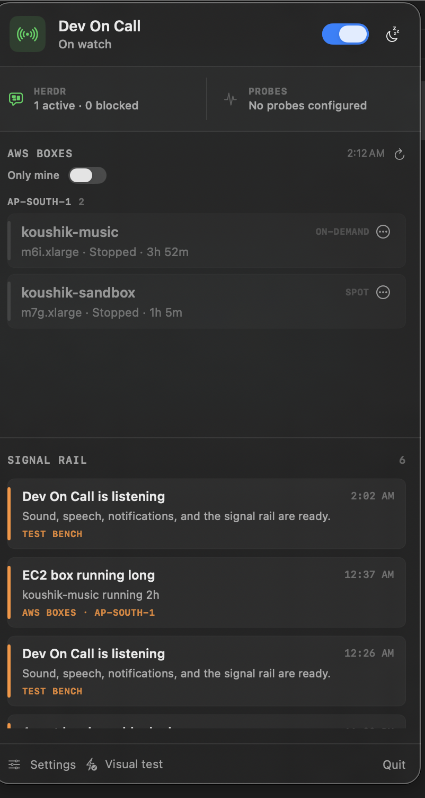
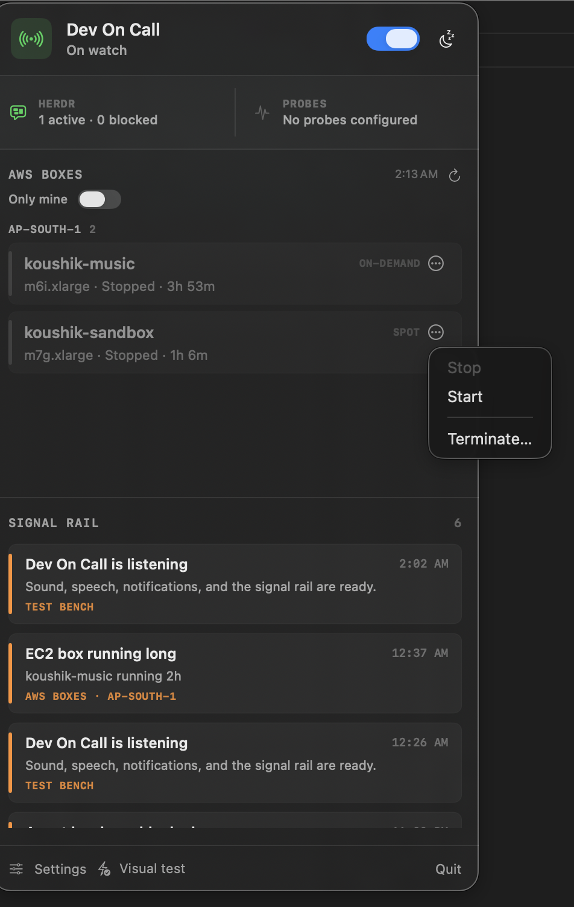

# Dev On Call

A quiet, local-first macOS menu-bar sentry for developers and their coding agents.

Dev On Call watches Herdr, terminal-fed events, and arbitrary shell probes for permission waits, account/session limits, failed CI, broken review bots, or anything else that can return an exit code. It can show a native notification, play one custom sound, and speak a concise deterministic or AI-written message.

System notifications, sound, and speech are **off by default**. The app never changes system volume and never loops an alarm.


## What it watches

- **Herdr, read-only:** pane state and recent output for permission prompts, blocked agents, usage/session/rate limits, test failures, and review failures.
- **Any terminal:** the included `dev-on-call` command drops an event into the local inbox.
- **Anything scriptable:** configure a shell probe where exit `0` means healthy and non-zero means alert.
- **CI and review bots:** call the companion CLI from a watcher, or poll their status with a shell probe.

Alerts are deduplicated for 15 minutes. Quiet hours, snooze, and disarm controls are one click from the menu bar.

## Install

Requirements: macOS 13 or newer.

Download the [latest DMG](https://github.com/wicolian/dev-on-call/releases/latest/download/Dev-On-Call-macOS.dmg), open it, and drag **Dev On Call.app** to Applications. Release builds are ad-hoc signed but not Apple-notarized, so macOS may require **Control-click → Open** the first time.

Or install the app and CLI without cloning:

```bash
curl -fsSL https://raw.githubusercontent.com/wicolian/dev-on-call/main/scripts/install.sh | bash
```

You can inspect [the install script](scripts/install.sh) before running it. It verifies the release checksum and installs into `~/Applications` and `~/.local/bin` without `sudo`.

Homebrew:

```bash
brew install --cask wicolian/tap/dev-on-call
```

### Build from source

Building requires the Swift command-line tools.

Or build from source:

```bash
git clone https://github.com/wicolian/dev-on-call.git
cd dev-on-call
./scripts/install-local.sh
open "$HOME/Applications/Dev On Call.app"
```

The installer builds and ad-hoc signs a menu-bar-only `.app`, installs it to `~/Applications`, and installs the companion CLI to `~/.local/bin/dev-on-call`.

Look for the **ON** badge in the menu bar. The app enables **Launch at login** on first run so the badge returns after a reboot; you can turn that off in **Settings** at any time.

The release DMG is universal and supports both Apple Silicon and Intel Macs.

## Send an alert from any terminal

```bash
dev-on-call alert \
  --source tests \
  --severity critical \
  --title "Tests failed" \
  --body "Open the latest test log."
```

Wrap any command:

```bash
npm test || dev-on-call alert --source tests --severity critical --title "npm test failed"
```

Severities are `info`, `warning`, and `critical`. Events are written to:

```text
~/Library/Application Support/DevOnCall/inbox/
```

## Connect one repository

Open **Settings → Connect**, choose a Git repository, and select **Install pre-commit alert**. You can optionally provide a test or lint command to run after its existing pre-commit hook. Dev On Call preserves and chains the active hook, keeps its original exit status, and only alerts when it fails.

The same setup is available from any directory:

```bash
dev-on-call install --repo /path/to/repository --command 'npm test'
dev-on-call status --repo /path/to/repository
dev-on-call uninstall --repo /path/to/repository
```

If `core.hooksPath` points to a shared hooks directory, the wrapper stays shared but checks a repository-local opt-in before doing anything. Removing a connection disables only that repository.

## Shell probes

In **Settings → Monitors**, add any command with this contract:

- exit `0`: healthy;
- non-zero or timeout: emit one incident;
- recovery after a failure: emit one recovery event.

Examples include a script that checks the latest GitHub Actions run, a review-bot status command, a local server health check, or a test watcher. Commands run as your macOS user, so only add commands you trust.

## AWS boxes (for the Databrain team)

If you're on the team and just want to keep an eye on our shared AWS account's EC2 boxes — see what's running, stop your own forgotten one, without typing any AWS CLI commands — this is for you.

### What it shows

- An **AWS Boxes** section in the popover, listing every EC2 instance in the shared account, grouped by region — name, type, state, spot/on-demand, and uptime.
- Our EC2 boxes live primarily in **ap-south-2 (Hyderabad)**, with `ap-south-1` (Mumbai) also checked while boxes are mid-move between the two.
- A box tagged with your name in its `Owner` tag gets a small **YOU** badge, and the **Only mine** switch in the section header filters the list down to just those.
- Rows running longer than 12 hours get an orange tint — a nudge that something may have been left on overnight.
- Each row's **···** menu has **Stop**, **Start**, and **Terminate** (Terminate always asks for confirmation naming the instance first).





### How to enable it

1. Open **Settings → AWS** and turn on **Show AWS boxes**.
2. The AWS CLI profile field defaults to `sako` — leave it as is unless someone tells you otherwise.
3. That's it. If your machine already has the `sako` profile configured, the list loads within a few seconds.

### First run

If you haven't run `aws configure --profile sako` yet, the AWS Boxes section shows a setup card instead of an error: a **Copy** button next to the exact command to run in Terminal. Paste your access key when prompted, and set the region to `ap-south-1` when it asks (the app itself checks both `ap-south-1` and `ap-south-2` regardless of what you set there). Ask in the team channel for an access key if you don't have one yet.

### Everything else

- The list auto-refreshes every 60 seconds; a manual refresh button is always there, and it disables itself while a refresh is already in flight so you can't queue up a pile of `aws` calls by mashing it.
- Every `aws` CLI call has a hard timeout, so a hung CLI (bad network, stale SSO session) can't freeze the popover.
- A CLI error (an expired SSO session, a missing `aws` binary) shows inline instead of crashing or hanging the app.
- The menu-bar label shows the running-instance count as a plain number next to the status glyph.

**Long-running alert:** optionally, the first time a running box crosses the configured hour limit, Dev On Call raises one warning straight into the same signal rail as every other alert (e.g. "EC2 box koushik-sandbox running 14h") — deduplicated the same way, through the same inbox path, not a second alerting system.

Like the rest of the app, this shells out to the `aws` CLI (`--output json`, no SDK) using whatever credentials/profile resolution the CLI already has configured. Dev On Call never reads or stores AWS credentials.

## Custom sound and speech

In **Settings → Alerts**:

1. enable **Play a sound**;
2. choose any macOS-readable audio file;
3. preview it explicitly;
4. optionally enable speech and configure quiet hours.

Each distinct incident plays at most once per deduplication window. Dev On Call does not raise volume, repeat audio, or bypass quiet hours unless you explicitly enable the critical-alert override.

## Optional Claude or Codex narration

In **Settings → Voice**, select Claude CLI or Codex CLI. Dev On Call uses the subscription login already present on the machine—no API key is read or stored.

- Claude defaults to `haiku`, runs non-interactively with tools disabled, and does not persist a session.
- Codex runs ephemerally in a read-only sandbox outside your repositories.
- AI is opt-in and consumes provider allowance.
- If the CLI is absent, unavailable, or itself rate-limited, speech falls back to a deterministic message.

Alert text is treated as untrusted data and truncated before narration. See [SECURITY.md](SECURITY.md) for the threat boundary.

## Development

```bash
swift run dev-on-call-self-test
swift build --product DevOnCall
swift build --product dev-on-call
```

Create distributable ZIP and DMG images:

```bash
./scripts/package-app.sh
```

### Account-side spend guards

[`tools/aws-guards`](tools/aws-guards) has three standalone Lambda
functions (spend-guard, gpu-swap, idle-stop) for enforcing EC2 spend
limits on the account side — the enforcement counterpart to this app's
read-only-by-default AWS Boxes popover. Not wired into the app; deployed
and configured independently. See its own README for thresholds and
deploy steps.

## Honest limitations

macOS does not expose every terminal's text buffer through one safe universal API. Dev On Call automatically reads Herdr through its documented read-only CLI. Other terminals integrate through `dev-on-call alert`, log/status scripts, or shell probes. The app does not request Accessibility or Screen Recording permission and does not scrape unrelated windows.

## License

[MIT](LICENSE)
